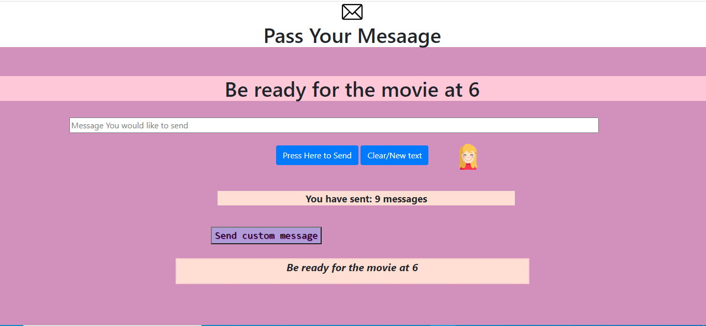

# Pass_Message
#📩Pass the message ,message functionalities-display and clear. Added functionality to generate custom🎀 messages. Keeps count of the message sent📤

#Most of the CSS styling🎨 is done through JavaScript.

#Alert is dislplayed when the count of messages exceed 5.
